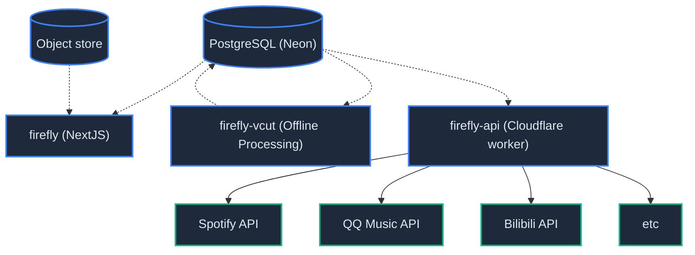

# firefly

一个B站虚拟主播的歌单网站，希望主包和dd们玩得开心~

This project is heavily based on the work of [@贝格耶喽](https://github.com/BigYellowhcy) and inspired by (reverse-engineered from) sites like [树礼Suki的歌单](https://shulisuki.top/), [桃几OvO的歌单 - 虚拟形象设定展示页](https://www.taojiovo.com/), and [明前奶绿 ✽ LAPLACE](https://laplace.live/). Thank you : )

## Showcase

- [蝶蝶Hikari的歌单](https://www.diehikari.top/)

## Architecture



## Getting Started

#### Clone the repo

```bash
git clone https://github.com/YangchenYe323/firefly.git && cd firefly
```

#### Install dependencies

This project is developed with [pnpm](https://pnpm.io/) and is not tested on other package managers.

```bash
pnpm install
```

#### Set up database

This project uses [PostgreSQL](https://www.postgresql.org/) as the database. It needs a running Postgres server to run. There are two ways you could set the server up:

1. [15 Minutes and some headache] Set up a local Postgres instance: https://www.prisma.io/dataguide/postgresql/setting-up-a-local-postgresql-database

2. [2 Minutes] Use a free managed Postgres service like [Neon Database](https://neon.tech/). **This is the recommended approach as setting up Postgres locally is still tedious.** The author develops and deploys the project using Neon.

After the database is up, add a `.env` file in the project root directory containing the database URL and a secret key of your choice:

- If you are using a local Postgres instance:
```
# firefly/.env
POSTGRES_PRISMA_URL="postgresql://postgres:<your password>@localhost:<your postgres port (default 5432)>/postgres"
NEXT_PUBLIC_JWT_SECRET_KEY=<Choose your secret>
NEXT_PUBLIC_API_URL=http://localhost:8787
```
- If you are using Neon:
```
# firefly/.env
POSTGRES_PRISMA_URL="<copy the URL from your neon console>"
NEXT_PUBLIC_JWT_SECRET_KEY=<Choose your secret>
NEXT_PUBLIC_API_URL=http://localhost:8787
```

#### firefly API

This project uses an API service for interfacing with external services like fetching artwork for song. The API endpoint is configured via the `NEXT_PUBLIC_API_URL` environment variable. The frontend will use this endpoint to display album covers for each song in the list.

**To run the API locally for development:**

- Please refer to [firefly-api](https://github.com/YangchenYe323/firefly-api) for instructions on starting a local instance of the API service (Cloudflare Worker).
- Set the `NEXT_PUBLIC_API_URL` environment variable in your `.env` file to the local API endpoint (e.g. `http://localhost:8787`).

Example `.env`:
```
NEXT_PUBLIC_API_URL=http://localhost:8787
```

If the API service is not available. The site could still function.

### Other environment variables

- `NEXT_PUBLIC_JWT_SECRET_KEY`: pick a secret key. It will be used to authenticate admin log in with JWT token
- `BILI_CRED_SESSDATA`, `BILI_CRED_BILIJCT` (optional): Bilibili login credentials. It is used for fetching video information for vtuber song. Use [biliup](https://github.com/biliup/biliup-rs) to login and get the credential.

#### Perform database migration

This project uses [Prisma-ORM](https://www.prisma.io/), and after the database is up, run the below command to initialize table and run migrations.

```Bash
pnpm prisma migrate dev
```

#### Run prisma code generator

```Bash
pnpm prisma generate
```

#### Start development server
```Bash
pnpm dev
```

#### Bootstrap an admin user

Admin user can access and manage all the vtuber profiles, songs, etc, and would be the starting point to populate the web page. Create an admin user by setting up your `.env` to point to your database instance and run

```Bash
pnpm bootstrap-admin
```

Then you can navigate to `localhost:3000/admin` to start making your website.

